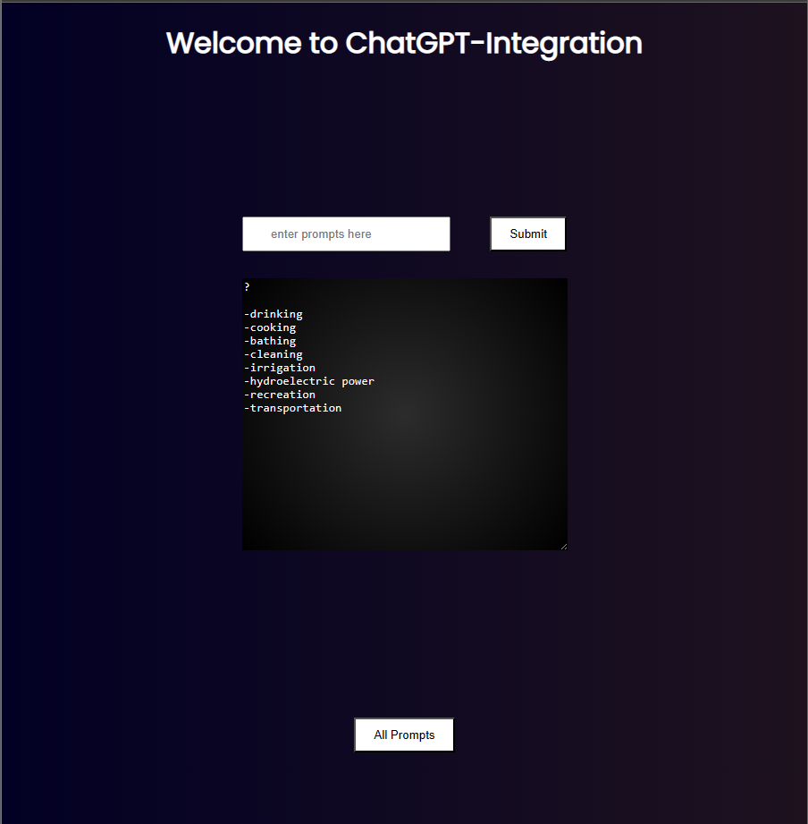
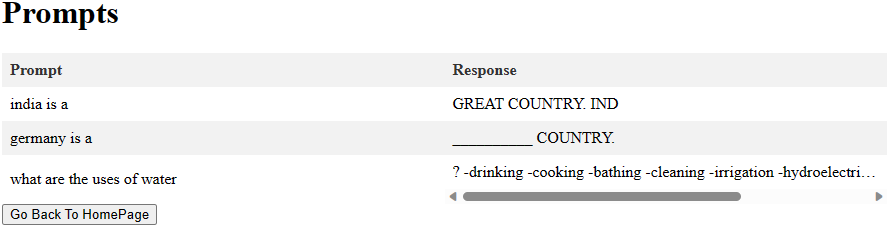

# ChatGPT-Integration-WebApp


home page:



The Prompts table:



how to use:
1. Clone the repository to your local machine by running the command:
    ```
   git clone https://github.com/atharv4git/ChatGPT-Integration-WebApp.git
   ```
2. Navigate to the project directory and create a virtual environment:
    ```
   cd ChatGPT-Integration-WebApp
    python3 -m venv venv
    ```
3. Activate the virtual environment:
    ```
   source venv/bin/activate
   ```
4. Install the required packages using pip:
    ```
   pip install -r requirements.txt
   ```
5. Set your OpenAI API key as an environment variable:
    ```
   export OPENAI_API_KEY=<your_api_key>
   ```
6. Run the Flask application:
   ```
   flask --app .\main.py --debug run
   ```
7. Open a web browser and navigate to http://localhost:5000 to access the application.
